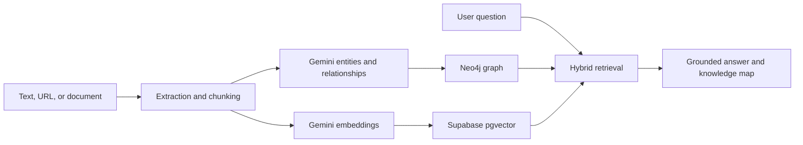

# InsightGraph Hybrid RAG Engine

InsightGraph is a hybrid retrieval application that combines vector search in Supabase with relationship-aware graph traversal in Neo4j. The goal is to ingest unstructured text, extract entities and relationships with Gemini, and then answer questions using both semantic context and graph structure.

[Live demo](https://hybrid-rag-engine-five.vercel.app) · [Repository](https://github.com/Elijah-cod/hybrid-rag-engine)

## What is included

- A Next.js 15 dashboard with:
  - a chat interface for hybrid answers
  - a live knowledge map powered by `react-force-graph-2d`
  - an ingestion console for pasting source text into the pipeline
- A Node.js API route for hybrid retrieval:
  - Gemini embeddings for query understanding
  - Supabase `pgvector` similarity search for relevant chunks
  - Neo4j neighborhood and shortest-path traversal for relationship context
  - Gemini answer synthesis using both retrieval channels
- A browser-local mock workspace that:
  - stores mock ingests in `localStorage`
  - performs deterministic chunking, extraction, embeddings, and graph building
  - keeps the chat, library, ingestion, and map surfaces explorable without paid connectors
- A Supabase Edge Function starter that:
  - chunks raw text
  - extracts entities and relationships with Gemini
  - seeds Neo4j with triplets
  - stores chunk embeddings in Supabase
- A starter SQL migration for the `documents` table and vector search RPC

## Architecture



1. Ingestion
   Raw text is sent to the Supabase Edge Function.

2. Extraction
   Gemini returns structured JSON with entities and triplets.

3. Storage
   - Triplets are written into Neo4j AuraDB.
   - Embeddings are written into Supabase `documents`.

4. Retrieval
   - Supabase returns semantically similar chunks.
   - Neo4j returns graph neighbors and shortest paths between extracted entities.

5. Synthesis
   Gemini combines chunk evidence and graph evidence into one answer.

## Local setup

1. Install dependencies:

```bash
npm install
```

2. Copy the environment template:

```bash
cp .env.example .env.local
```

3. Fill in your secrets in `.env.local`.

Recommended starting values:

```bash
GOOGLE_TEXT_MODEL=gemini-2.0-flash
GOOGLE_EMBEDDING_MODEL=gemini-embedding-001
```

4. Run the app:

```bash
npm run dev
```

5. Open [http://localhost:3000](http://localhost:3000).

6. Start Supabase locally if you want to run the Edge Function:

```bash
supabase start
supabase functions serve ingest-documents --env-file supabase/.env.local
```

## Exploring without Gemini quota

- Turn on `Mock AI` in the dashboard header.
- Use `Seed Local Demo` to load the built-in sample workspace instantly, or ingest your own text locally.
- Ask questions in `hybrid`, `vector`, or `graph` mode to inspect how the UI behaves without live Gemini calls.

Mock AI is now a fully local browser path. It does not depend on Gemini, Supabase, or Neo4j for ingestion or chat, which means the app remains demoable even when free-tier quotas are exhausted or external services are paused.

## Free AI toolkit

The redesigned dashboard links to a few practical free or local-friendly tools:

- [Gemini API free tier](https://ai.google.dev/gemini-api/docs/pricing) for validating the real cloud connector flow
- [Ollama](https://ollama.com/download) for running local chat and embedding models
- [LM Studio](https://lmstudio.ai/download) for desktop-based local model testing
- [Hugging Face Inference Providers](https://huggingface.co/docs/inference-providers/index) for free experimentation and backup provider comparisons

These are best treated as complementary paths:

- `Live AI` proves the end-to-end production connector story.
- `Mock AI` keeps the interface explorable with deterministic local logic.
- Local model tools such as Ollama or LM Studio are a good next step if you want a no-cost runtime that still uses real models.

## Required environment variables

### Next.js app

- `GOOGLE_AI_API_KEY`
- `GOOGLE_TEXT_MODEL`
- `GOOGLE_EMBEDDING_MODEL`
- `NEO4J_URI`
- `NEO4J_USERNAME`
- `NEO4J_PASSWORD`
- `NEO4J_DATABASE`
- `NEXT_PUBLIC_SUPABASE_URL`
- `NEXT_PUBLIC_SUPABASE_ANON_KEY`
- `SUPABASE_SERVICE_ROLE_KEY`

### Supabase Edge Function

Add these to Supabase project secrets or `supabase/.env.local`:

- `SUPABASE_URL`
- `SUPABASE_SERVICE_ROLE_KEY`
- `GOOGLE_AI_API_KEY`
- `GOOGLE_TEXT_MODEL`
- `GOOGLE_EMBEDDING_MODEL`
- `NEO4J_URI`
- `NEO4J_USERNAME`
- `NEO4J_PASSWORD`
- `NEO4J_DATABASE`

## Database setup

Run the migration in [`supabase/migrations/20260417000000_init_documents.sql`](supabase/migrations/20260417000000_init_documents.sql).

It creates:

- the `vector` extension
- the `documents` table
- an `ivfflat` similarity index
- the `match_documents` RPC used by the hybrid search route

## App routes

- `/` dashboard UI
- `/api/chat` hybrid RAG response route
- `/api/ingest` server-side ingestion route
- `/api/health` simple warmup endpoint
- `/api/readiness` live deployment readiness route

## Pre-deployment verification

Run the same checks locally before pushing:

```bash
npm run typecheck
npm run lint
npm run build
```

## Deployment notes

- Keep all secrets in Vercel and Supabase environment variables.
- Do not expose the Neo4j password or Supabase service role key to the client.
- The dashboard includes a cooldown and pending-state UX to reduce Gemini free-tier rate limit issues.
- The dashboard also includes a browser-local fallback mode so demos can continue when live connectors are unavailable.
- The client pings the backend on load so the first request feels less abrupt during cold starts.
- Before calling the app "ready", apply the Supabase migration and run the dashboard's Deployment Readiness check or hit `/api/readiness` directly.

## Deployment checklist

1. Set all required environment variables in Vercel.
2. Apply the Supabase migration.
3. Deploy the Next.js app to Vercel.
4. Open the deployed dashboard and run the Deployment Readiness check.
5. Ingest one sample source and confirm it appears in Source Library.
6. Validate one chat request in `hybrid` mode and inspect the Knowledge Map.
7. Confirm all checks return `ok` before calling the deployment production-ready.

## Recommended workflow

1. Build on a feature branch.
2. Merge into `develop` for testing.
3. Open a PR from `develop` to `main` when ready.

## Current limitations

- Retrieval quality does not yet have an automated evaluation suite.
- Mock AI is intended for deterministic product exploration, not quality benchmarking.
- Output quality and latency depend on the configured Gemini models and service quotas.
- The complete live pipeline still requires separately provisioned Supabase and Neo4j services.

## Security

Keep all credentials in local or deployment environment variables. Never commit Gemini keys, Neo4j credentials, or the Supabase service-role key. Rotate any credential that may have been exposed during development.
